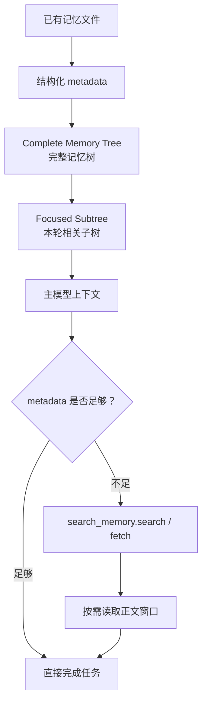
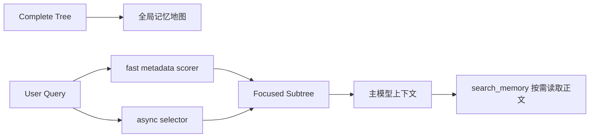
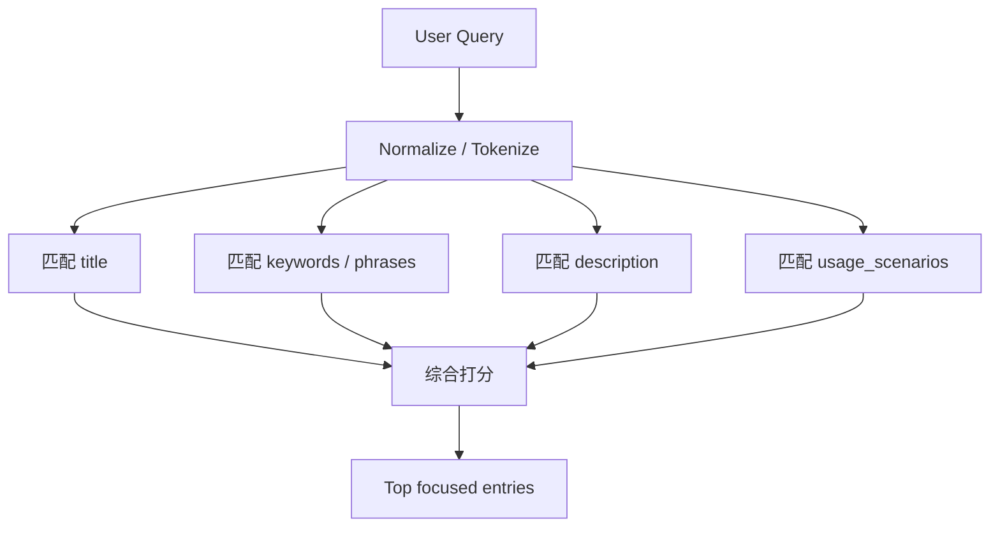
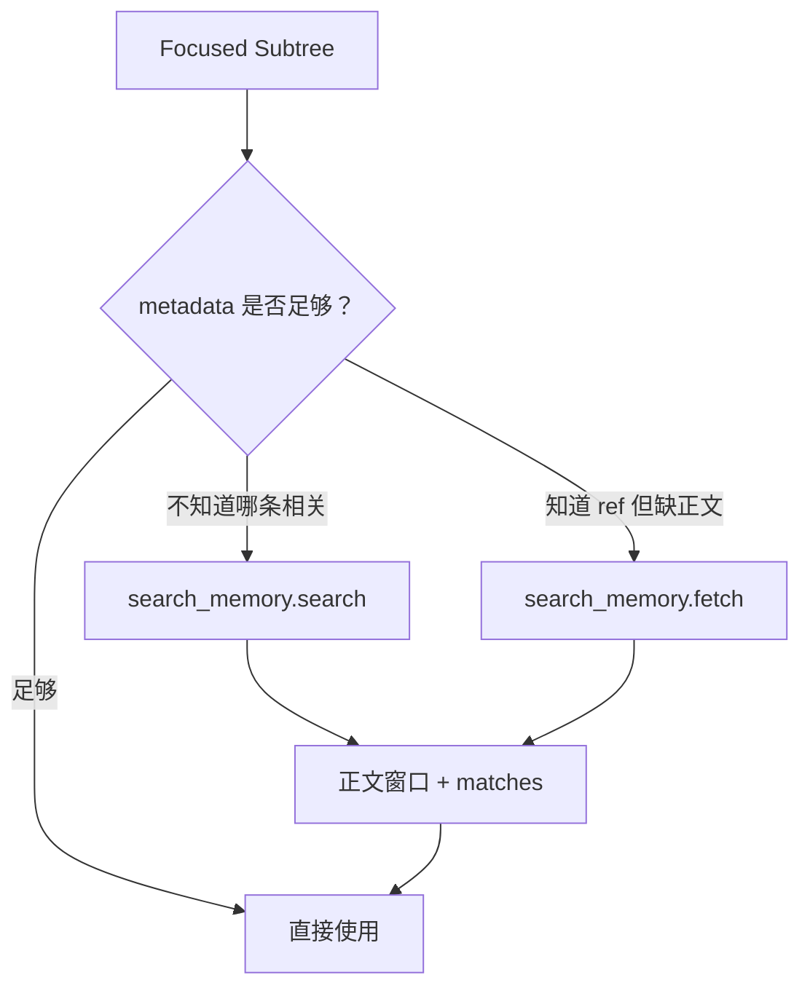
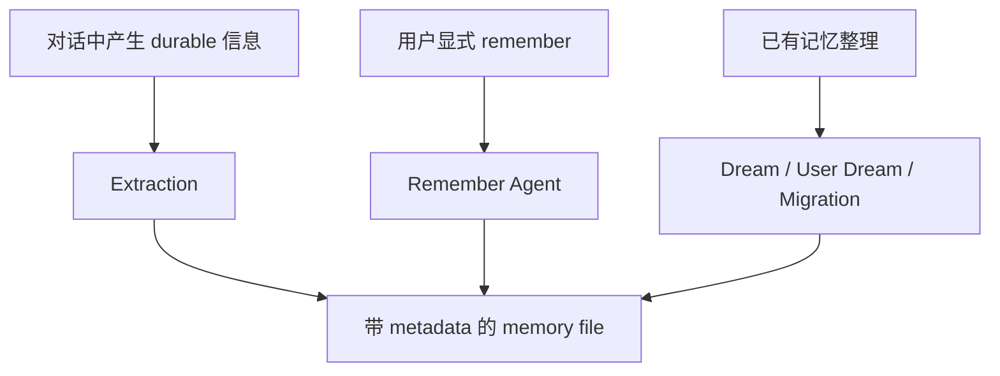
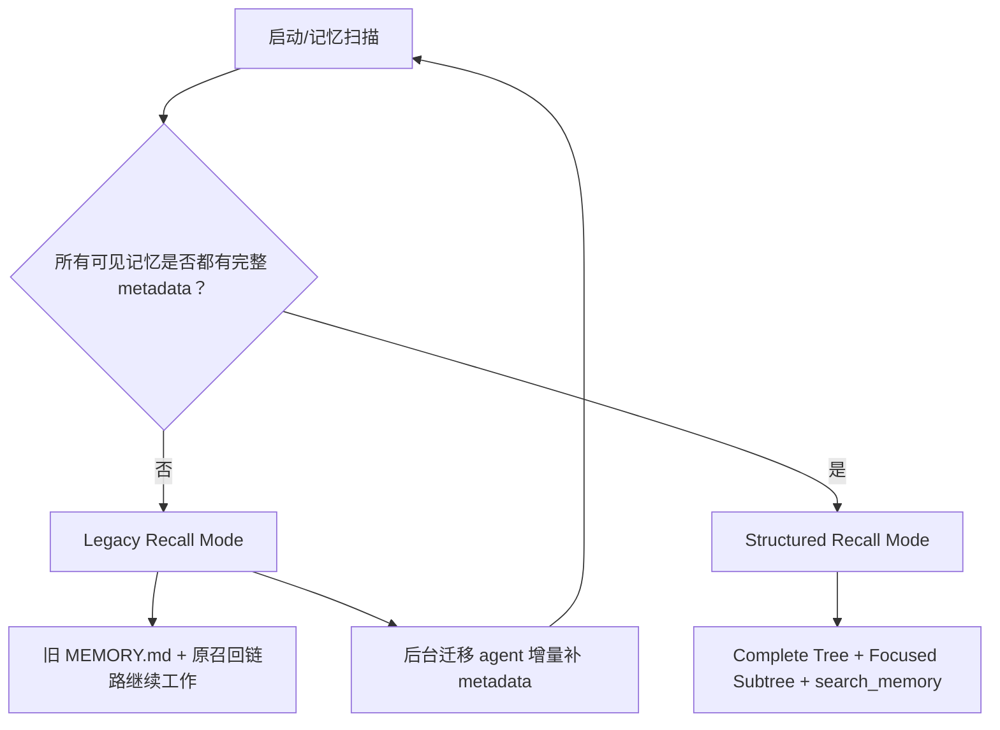
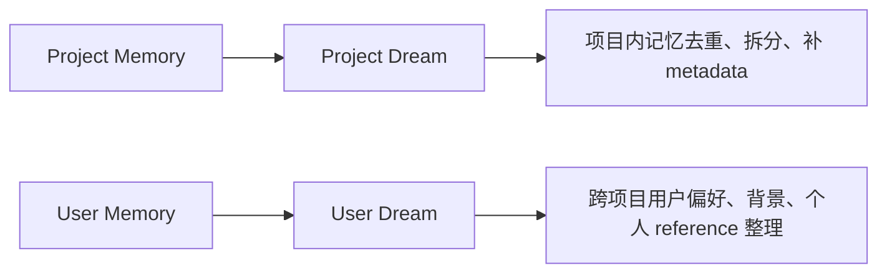
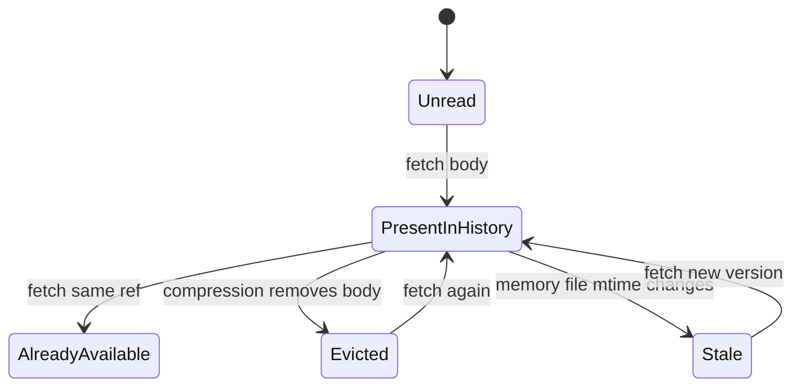
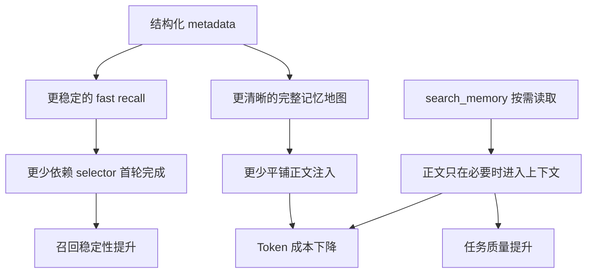

# Auto Memory 结构化召回设计

## 核心思路

这次设计的目标不是简单增加一个检索工具，而是把 Auto Memory 从“平铺索引 + 选中后注入正文”改成“完整记忆地图 + 本轮聚焦子树 + 按需读取正文 + 无损迁移”。

模型先看到有哪些记忆、它们属于什么主题、适合什么场景；只有 metadata 不足以完成任务时，才读取记忆正文。



## 树结构

完整记忆树是全局地图，主要展示 category、ref 和 title，让模型知道所有可见记忆如何组织。

```text
Complete memory tree

tool_experience
├── [project:reference/cua-driver-rs.md] cua-driver-rs-reference
├── [project:project/model-pull-memory.md] model-pull-memory-design
└── [user:feedback/code-review-style.md] code-review-style

project_context
├── [project:project/qwen-code-eval.md] qwen-code-eval-context
└── [team:reference/release-process.md] release-process
```

每轮用户请求只注入 focused subtree。它是完整树中的查询相关部分，不是一棵新的独立树。

```text
Memory focus for this turn

The paths below are the query-relevant subtree for this turn.
They add focus to the existing memory tree; they do not replace it.

└── tool_experience
    关键词：qwen code memory, selector, search_memory, metadata recall
    ├── [project:project/model-pull-memory.md] model-pull-memory-design
    │   摘要：...
    │   适用：...
    └── [内容已在当前上下文] [project:reference/cua-driver-rs.md] cua-driver-rs-reference
```

如果某条记忆正文已经在当前上下文中，focused subtree 只保留占位符，避免重复注入正文。

## 上下文组织

旧链路更接近下面这种结构：


新链路把记忆正文从默认上下文中移出去，只留下地图和本轮聚焦路径：



目标上下文从：

```text
MEMORY.md + selected body + selected body + selected body
```

变成：

```text
Complete Tree + Focused Subtree + on-demand body
```

## 召回方法

召回分为三层。

第一层是 fast metadata recall。它在很小的延迟预算内完成，用于首轮给模型一个可靠入口。它主要匹配 title、keywords、description、usage_scenarios，并且只把 body 作为低权重 fallback。



关键词 metadata 是确定性召回的核心，不是装饰标签。关键词可以是普通词，也可以是短语、API 名称、工具名、issue id、模型名或项目特定 identifier。

```yaml
keywords:
  - qwen code memory recall
  - selector latency
  - search_memory
  - focused subtree
  - qwen3.7-max
```

第二层是 async selector。selector 保留为语义精排层，继续异步运行。它不再承担首轮是否能看到记忆入口的唯一责任，而是在后续安全注入点交付 refined focused subtree。

第三层是 `search_memory`。当 focused subtree 中的 metadata 不足时，模型可以主动搜索或读取正文。



## Metadata 写入

metadata 来自三个入口：自动 extraction、用户显式 remember、后台 dream/migration。



每条记忆应保留完整正文，同时补齐用于召回的 metadata。

```yaml
---
name: model-pull-memory-design
description: Qwen Code Auto Memory should use structured metadata, focused subtree recall, and search_memory for on-demand body retrieval.
type: project
category: tool_experience
keywords:
  - qwen code memory recall
  - focused subtree
  - search_memory
  - selector latency
usage_scenarios:
  - Designing Auto Memory recall behavior
  - Evaluating selector and fast recall tradeoffs
---
正文内容...
```

`description` 说明这条记忆是什么，`keywords` 提供召回键，`usage_scenarios` 描述未来什么任务会用到它，`category` 决定它在主题树中的位置。

## 无损迁移

已有用户记忆不能被一次性切断或破坏，因此迁移采用双链路共存。



迁移原则：

- 不破坏旧正文。
- 不让旧记忆失效。
- 未迁移时继续走旧链路。
- 迁移完成后自动切换到结构化链路。
- 如果后续又出现未打标文件，允许回退 legacy 或重新进入迁移。

## Project Memory 和 User Memory

project memory 和 user memory 需要分别整理。



project dream 适合结合项目上下文和 transcript 整理项目记忆。user dream 应只整理跨项目用户记忆，不读取项目文件或项目 transcript。这样可以避免用户级记忆随着项目数量和会话数量持续增长。

## 正文可见性

新链路需要区分“曾经读过”和“当前上下文仍然可见”。



目标行为：

- 正文仍在上下文时，重复 fetch 返回 alreadyAvailable。
- 正文被压缩移除后，允许重新 fetch。
- 记忆文件发生变化后，允许读取新版本。

## 预期收益



理论收益主要有三类：

1. 降低 token：metadata 足够时不读正文，已读正文不重复注入。
2. 提高召回准确度：关键词、短语和 identifier 比全文偶然词命中更稳定。
3. 提高任务质量：模型先看到记忆地图，再按需读取正文，更接近真实知识库使用方式。

最终收益需要通过真实 API usage、真实任务 A/B 和 LLM-as-judge 评测确认，不能只用字符数估算。

## 总结

这个设计把 Auto Memory 从“被动注入的文本块”改成“可导航、可检索、可按需读取的记忆地图”。完整树提供全局理解，focused subtree 提供当前任务聚焦，keywords/phrases 提供确定性召回入口，`search_memory` 提供正文按需读取能力，legacy fallback 和后台迁移保证已有记忆可以无损过渡。
