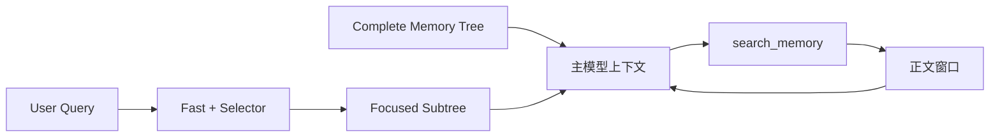
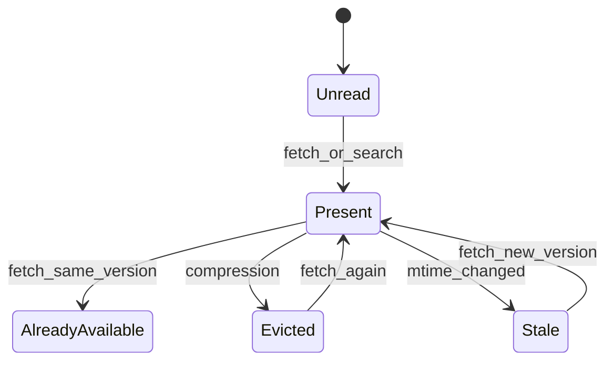

# Auto Memory 结构化召回设计

## 目标

Auto Memory 原有链路把 `MEMORY.md` 平铺索引加入主模型上下文，再由
selector 或启发式规则选择记忆正文。随着记忆增长，这种组织方式会让默认
上下文持续变大，并让模型难以理解记忆之间的主题关系。

结构化召回把这条链路调整为：

```text
Complete Memory Tree + Focused Subtree + on-demand body
```

完整树提供全局地图，本轮子树提供查询焦点，`search_memory` 只在 metadata
不足时读取正文。已有未打标记忆继续走 Legacy 链路，并由后台迁移逐步补齐
metadata，全部可见语料就绪后再切换协议。

本设计的目标是：

- 保留现有记忆文件和正文，不要求用户手动迁移。
- 用层次树代替主模型中的平铺索引。
- 降低默认上下文和重复正文带来的 Token 消耗。
- 同时保留确定性快速召回和模型语义选择能力。
- 让正文读取、压缩清除和文件更新具有一致的状态语义。

## 存储与 Scope

结构化召回不改变记忆文件的跨平台路径计算方式。Windows、Linux 和 macOS
使用相同的逻辑结构，但基础目录遵循各平台和运行时的路径解析结果。

| Scope   | 默认位置                                       | 语义                                      |
| ------- | ---------------------------------------------- | ----------------------------------------- |
| Project | `<memory-base>/projects/<project-key>/memory/` | 当前 Git root 或 workspace 的私有项目记忆 |
| User    | `<memory-base>/memories/`                      | 跨项目共享的用户偏好和背景                |
| Team    | `<git-root>/.qwen/team-memory/`                | Git 跟踪的团队共享记忆                    |

`QWEN_CODE_MEMORY_BASE_DIR` 可以覆盖基础目录。仅 Project Memory 响应
`QWEN_CODE_MEMORY_LOCAL=1`，此时它位于 `<project>/.qwen/memory/`；User
Memory 仍位于全局 memory base 下，不会变成项目内的 `user/` 子目录。

Project root 内的 `user/*.md` 仍属于 Project scope。目录名只用于组织，scope
由扫描使用的 root 决定。

每条主题记忆使用 YAML frontmatter 和 Markdown 正文：

```yaml
---
name: model-pull-memory-design
description: Qwen Code Auto Memory uses structured metadata and on-demand body retrieval.
type: project
category: tool_experience
keywords:
  - structured memory recall
  - focused subtree
  - search_memory
usage_scenarios:
  - Designing Auto Memory recall behavior
  - Evaluating recall quality and token cost
---
```

`name`、`description`、`category`、`keywords` 和 `usage_scenarios` 都来自完整
正文，并在正文语义变化时同步更新。`keywords` 可以包含普通词、短语、API、
工具名、issue id 或项目特定 identifier。

## 两种召回协议

### Legacy

只要任一当前可见 scope 中还存在缺失或无效结构化 metadata 的记忆，会话就
使用 Legacy 协议：

```text
MEMORY.md -> selector / heuristic -> selected body snippets
```

Legacy 保留原有 surfaced-path 去重和 active-tool 噪声过滤。后台迁移不会切断
这条链路，因此旧记忆在迁移期间仍然可召回。

### Structured

当所有可见记忆均通过 metadata 校验后，系统准备新的索引和 system prompt，
再次确认 corpus revision 未变化，然后原子提交 `legacy -> structured` 切换。
准备或确认失败时保持 Legacy，不交付一半的新协议。

Structured 协议由三个部分组成：



当前实现只在会话内执行 `legacy -> structured`。Structured 会话不会因为一次
外部文件变化立即自动回退；正常的 Extraction、Remember、Dream 和 Migration
写入必须始终生成有效 metadata，新会话启动时会重新判断 corpus readiness。

## Complete Memory Tree

Complete Tree 是当前 snapshot 的全局 metadata 地图，只包含 category、无损
`ref` 和 title，不包含正文或平铺 `MEMORY.md` 内容：

```text
## Complete memory tree

tool_experience
├── [project:reference/cua-driver-rs.md] cua-driver-rs-reference
└── [project:project/model-pull-memory.md] model-pull-memory-design

project_context
└── [team:reference/release-process.md] release-process
```

它在 Structured 协议首次交付时进入上下文。之后只有 corpus revision 变化时才
交付新版本，并明确替换旧版本；不会在每轮 UserQuery 重复注入相同完整树。
TUI 和 ACP 都在请求真正发送后提交 delivered revision，发送失败或取消不会
错误推进交付状态。

`ref` 是协议身份，不是展示字符串。它使用 scope 和无损相对路径编码，展示
规范化不会改变 ref；扫描阶段会检测身份冲突，保证每个文件都能唯一 fetch。

## Focused Subtree

Focused Subtree 是 Complete Tree 中与当前请求相关的路径，不是一棵新全局树：

```text
## Memory focus for this turn

The paths below are the query-relevant subtree for this turn. They add focus
to the existing memory tree; they do not replace it.
└── tool_experience
    关键词：structured memory recall, selector latency, search_memory
    ├── [project:project/model-pull-memory.md] model-pull-memory-design
    │   摘要：...
    │   适用：...
    └── [内容已在当前上下文] [project:reference/cua-driver-rs.md] cua-driver-rs-reference
```

同一 category 的关键词在父节点聚合，避免每个 leaf 重复展示相同关键词。leaf
保留 ref、title、description 和 usage scenarios。Focused prompt 有固定字符
预算，超出时按召回顺序减少 leaf，并明确标记省略数量。

正文是否显示为“已在当前上下文”由内存中的 `bodyPresentVersions` 决定：

- 未读取：显示 metadata，模型可按需 search 或 fetch。
- 正文仍在历史中且 mtime 一致：leaf 显示正文已存在的占位符。
- 正文已被压缩清除：移除驻留状态，再次显示可读取 metadata。
- 文件 mtime 变化：旧正文视为 stale，允许读取新版本。

占位只替代 leaf 的正文提示，不删除 category 的聚合关键词，也不删除 ref 和
title。

## Fast Recall 与 Selector

Fast scorer 和 selector 读取同一个 snapshot，并行承担不同职责：

1. Fast scorer 是确定性入口，最多选择两条候选，优先精确 title、identifier、
   完整 keyword phrase 和多 metadata term 覆盖。
2. Selector 接收有界 metadata manifest，执行语义选择和精排。
3. Fast 结果先到时可在首个可用交付点形成 Focused Subtree。
4. Selector 的 refined 结果在后续安全注入点交付，并与 fast 结果按 ref 合并，
   不缩小 Complete Tree snapshot。

短 Latin keyword 使用 token boundary，避免 `ai` 命中 `explain`。Han、Hiragana、
Katakana 和 Hangul 使用一致的 CJK tokenizer。正文只作为低权重 fallback，不能
让普通正文词压过明确 metadata 命中。

Selector 是异步 side query，不阻塞确定性 fast 入口。若 selector abort、超时或
返回无效结果，fast/fallback 仍可继续主请求。当前 manifest 保持 25,000 bytes
上限；这是上下文预算，不代表所有大语料候选都必然进入 selector。

## `search_memory`

Structured 主模型只通过 `search_memory` 按需获取 managed-memory 正文：

- `search`：不知道准确 ref 时，使用 1 至 5 个关键词，可选 scopes、categories
  和结果数量。
- `fetch`：已经知道 ref 时直接读取；ref 必须从树或搜索结果原样复制。
- `cursor`：只用于相邻正文窗口 continuation，不属于新的 search 请求。

搜索支持 Unicode letters/numbers 以及 Han、Hiragana、Katakana、Hangul。多个
scope 在扫描前稳定去重，排序综合 metadata 覆盖率、短语/identifier 命中、
语料稀有度和未覆盖关键词。

Search 和 fetch 都有结果数、窗口和总正文预算。预算由 `search_memory` 自己
执行，工具调度器不再二次截断其 JSON。一个窗口被文件可读范围截断不等于
整个 ref 已耗尽；只有本轮累计 per-ref 正文预算实际用完才标记 exhausted。

每个新 UserQuery 重置本轮 duplicate claim 和 exhausted refs，ToolResult
continuation 不重置。文件在 snapshot 后消失时返回 `missingRefs` 和 warning，
不静默假装 fetch 完成。

## 正文驻留与压缩

系统区分“这个 session 曾经读过”与“正文现在仍存在于模型历史”：



`search_memory` 正文结果进入历史后记录 ref 和 mtime。重复 fetch 同一版本返回
`alreadyAvailable`，不重复正文。Microcompaction 或 memory-pressure compaction
清除工具结果时，先把被清除 ref 反馈给 MemoryManager，再渲染下一份 Focused
Subtree，因此不会出现“占位符说正文还在，但历史已经删除”的状态。

ToolResult 路径先执行 size-only microcompaction，再消费 recall snapshot。这个
顺序同时适用于正常主循环和 ACP 会话。

## Managed-memory 访问边界

通用文件工具不能绕过 Structured 协议直接读取正文：

| 调用者              | Read            | Glob            | Grep            | LS/Folder       | Shell                   |
| ------------------- | --------------- | --------------- | --------------- | --------------- | ----------------------- |
| Legacy 主模型       | 保持原行为      | 保持原行为      | 保持原行为      | 保持原行为      | 保持原行为              |
| Structured 主模型   | 拒绝            | 隐藏            | 排除            | 隐藏            | 拒绝 managed roots      |
| Memory scoped Agent | capability 控制 | capability 控制 | capability 控制 | capability 控制 | capability 与 allowlist |
| Generic Subagent    | 不自动授权      | 不自动授权      | 不自动授权      | 不自动授权      | 不自动授权              |

Dream、User Dream、Extraction 和 Remember 使用 scoped config，显式获得需要的
direct-read/direct-write 能力。普通 forked subagent 不因为 Structured 模式而
自动获得记忆访问权限。

Shell gate 同时检查命令参数和 resolved cwd，避免先把 cwd 设为 memory root，
再用裸文件名读写。Project、User、Team roots 使用同一 containment 语义。

## Metadata 写入和后台任务

四条写入路径都必须维持结构化 metadata：

- Extraction：从新增对话中提取 durable 信息。
- Remember：处理用户显式记忆请求。
- Dream / User Dream：整理、去重、拆分已有记忆。
- Migration：只为 Legacy 文件补齐 metadata，不承担日常 Dream 职责。

Migration 每个 batch 最多尝试 10 个文件、最多读取 40,000 字符正文。每个完成
的 UserQuery 最多触发一批 Project 和 User migration；同一 scope/root 已有任务
运行时返回 `running`，不排队自动接力。Headless 单轮退出时不会隐式 self-drain
后续批次，以免改变退出延迟和后台模型成本。用户可以通过现有 task surface
查看和取消 migration。

Project Dream 和 User Dream 对同一 root 使用 PID/mtime lock，多个 session 不会
并发整理同一语料。拿不到锁的 session 返回 `locked`，不会自动排队接力。
Dream 继续按既有 mutation、时间和文档数量门控触发，不负责迁移全部旧文件。

`pinned/` 是用户保护区。维护 Agent 的工具配置禁止修改 pinned 文件，Dream
manifest executor 也拒绝 delete、dedupe 和 split 指向 pinned 路径。每次 Dream
持锁启动 planner 前先删除遗留 manifest，避免异常退出留下的旧操作被下一次
运行执行。

## 迁移安全与一致性

迁移遵循以下约束：

- 保留文件正文，只更新 frontmatter。
- 读取前拒绝 symlink memory root 和 root boundary escape。
- 叶子提交使用 no-follow 和 source hash/CAS，文件并发变化时不覆盖新版本。
- 单文件并发消失可以跳过并保留已提交进度。
- 权限错误和 root 安全错误使对应 scope 明确失败，不能静默标记 ready。
- 不存在的兼容 root 是 no-op，不为它创建目录，也不阻塞协议切换。
- 每提交一条 metadata，后续生成即可使用最新 canonical vocabulary。

只有所有请求 scope 都完成校验，readiness 才为 true。索引重建、revision 二次
确认和 prompt 构建全部成功后才提交 Structured 协议。

## 可观测性

Telemetry 分别记录：

- recall scan、fast、selector 和 delivery timing；
- Complete Tree 是否交付及 discard 原因；
- search/fetch 返回数量、正文字符数和 source status；
- migration 扫描、legacy、提交、冲突、失败、Token 与耗时；
- recall mode transition。

日志不记录查询正文、记忆正文或物理文件路径。Selector 命中率和交付时序只有
在对应 timeline telemetry 实际存在时才能形成评测结论。

## 质量与成本判断

理论上，Structured 模式通过移除平铺 `MEMORY.md`、避免重复正文和按需窗口读取
降低主上下文 Token；通过完整主题地图、metadata fast recall 和 selector 精排
提高召回稳定性。但这些是设计假设，不等同于实证结论。

评测必须在同模型、同仓库 revision、同记忆 corpus、独立新上下文和固定 case
下比较 Legacy 与 Structured，并同时报告：

- 任务质量与召回质量；
- recall contribution、miss 和工具失败；
- 主链路与后台任务 Token；
- P50/P95 延迟与 runtime failure；
- selector timing、Complete Tree/Subtree 交付和正文读取行为。

当前大样本评测显示质量差值的置信区间仍跨零，因此不能宣称质量显著提高；
Token 和中位延迟有下降信号，但本轮 correctness 修复后仍需使用同一批 case
重新验证。

## 非目标

本设计当前不包含：

- 在一次 headless 调用退出前自动连续跑完全部 migration batch；
- 无评测依据地扩大 selector manifest 预算；
- 让 Dream 承担旧语料全量迁移；
- 让 Generic Subagent 或外部记忆系统自动获得 managed-memory 权限；
- 把逐 case 评测数据、原始 API 日志或完整 transcript 纳入设计文档。

## 总结

结构化召回把 Auto Memory 从平铺正文集合改为可导航、可检索、可按需读取的
记忆地图。Complete Tree 提供全局理解，Focused Subtree 提供当前任务焦点，
fast scorer 和 selector 共同选择路径，`search_memory` 管理正文窗口和驻留状态，
Legacy fallback 与增量迁移保护已有用户记忆。协议切换、安全边界和压缩反馈
共同保证这套链路不仅能召回，还能在长会话和多 session 环境中维持一致性。
